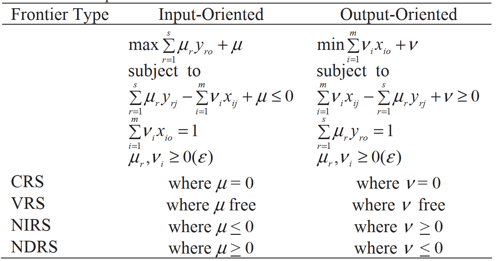

=================================
DEA: Multiplier Model
=================================

The dual linear programming problems to the envelopment models are 
called multiplier models. See the following Table:

(*Source: Zhu, J., 2009. Multiplier and slack-based models. In Quantitative Models for Performance Evaluation and Benchmarking. Springer, Boston, MA.*)

Example: DEA dual models `[.ipynb] <https://colab.research.google.com/github/ds2010/pyStoNED/blob/master/notebooks/DEA_dual.ipynb>`_
----------------------------------------------------------------------------------------------------------------------------------------

.. code:: python
    
    # import packages
    from pystoned import DEA
    from pystoned import dataset as dataset
    from pystoned.constant import RTS_VRS, OPT_LOCAL, ORIENT_IO
        
    # import the data provided with Tim Coelli’s Frontier 4.1
    data = dataset.load_Tim_Coelli_frontier()
        
    # define and solve the DEA multiplier model
    model = DEA.DUAL(data.y, data.x, rts=RTS_VRS, orient=ORIENT_IO, yref=None, xref=None)
    model.optimize(OPT_LOCAL)
    
    # display the multiplier y
    model.display_mu()

    # display the multiplier x
    model.display_nu()

    # print the technical efficiency
    print(model.get_efficiency())