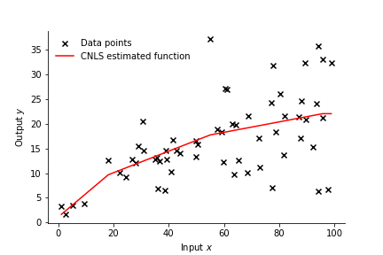

=================================================================
Plot of estimated function/frontier: one-input and one-output
=================================================================

Example: 2D plot with CNLS `[.ipynb] <https://colab.research.google.com/github/ds2010/pyStoNED/blob/master/notebooks/2dplot.ipynb>`_
---------------------------------------------------------------------------------------------------------------------

.. code:: python

    # import packages
    from pystoned import CNLS
    from pystoned.plot import plot2d
    from pystoned.constant import CET_ADDI, FUN_PROD, OPT_LOCAL, RTS_VRS
    from pystoned.dataset import load_Finnish_electricity_firm

    # import Finnish electricity distribution firms data
    data = load_Finnish_electricity_firm(x_select=['Energy'], y_select=['TOTEX'])

    # define and solve the CNLS model
    model = CNLS.CNLS(y=data.y, x=data.x, z=None, cet = CET_ADDI, fun = FUN_PROD, rts = RTS_VRS)
    model.optimize(OPT_LOCAL)

    # Plot the estimated function
    plot2d(model, x_select=0, label_name="CNLS estimated function", fig_name="CNLS_2d")

