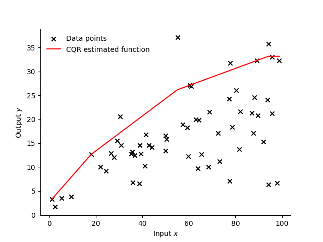

=================================================================
Plot of estimated function/frontier: one-input and one-output
=================================================================

Example: 2D plot with CNLS and CQR  `[.ipynb] <https://colab.research.google.com/github/ds2010/pyStoNED/blob/master/notebooks/2dplot.ipynb>`_
-----------------------------------------------------------------------------------------------------------------------------------------------

.. code:: python

    # import packages
    from pystoned import CNLS, CQER
    from pystoned.plot import plot2d
    from pystoned.constant import CET_ADDI, FUN_PROD, OPT_LOCAL, RTS_VRS
    from pystoned.dataset import load_Tim_Coelli_frontier

    # import the data from Tim Coelli Frontier 4.1 
    data = load_Tim_Coelli_frontier(x_select=['labour'],
                                y_select=['output'])

    # define and solve the CNLS model
    CNLS_model = CNLS.CNLS(y=data.y, x=data.x, z=None, cet = CET_ADDI, fun = FUN_PROD, rts = RTS_VRS)
    CNLS_model.optimize(OPT_LOCAL)

    # Plot the estimated function 
    plot2d(CNLS_model, x_select=0, label_name="CNLS estimated function", fig_name="CNLS_2d")

    # define and solve the CQR model
    CQR_model=CQER.CQR(y=data.y, x=data.x, tau=0.5, z=None, cet=CET_ADDI, fun=FUN_PROD, rts=RTS_VRS)
    CQR_model.optimize(OPT_LOCAL)

    # Plot the estimated function 
    plot2d(CQR_model, x_select=0, label_name="CQR estimated function", fig_name="CQR_2d")

.. image:: ../../../../notebooks/CNLS_2d.png
    :width: 600
    :alt: CNLS estiamted function

