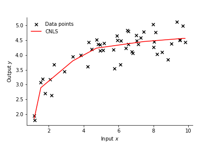

.. pyStoNED documentation master file, created by
   sphinx-quickstart on Sun Nov 15 14:11:07 2020.
   You can adapt this file completely to your liking, but it should at least
   contain the root `toctree` directive.

Welcome to pyStoNED 0.4.7
====================================

`pyStoNED <https://pypi.org/project/pystoned/>`_ is a Python package that provides functions for estimating Convex Nonparametric Least Square (CNLS), 
Stochastic Nonparametric Envelopment of Data (StoNED), and other various StoNED-related variants such as Convex Quantile Regression (CQR), 
Convex Expectile Regression (CER), and Isotonic CNLS (ICNLS). It also provides efficiency measurement using Data Envelopement Analysis (DEA) 
and Free Disposal Hull (FDH). The pyStoNED package allows the user to estimate the CNLS/StoNED frontiers in an open-access environment and 
is built based on the Pyomo.

For example `[.ipynb] <https://colab.research.google.com/github/ds2010/pyStoNED/blob/master/notebooks/Ex1.ipynb>`_, the following code estimates the basic CNLS model and plot the production frontier.

.. code:: python

   # import packages
   import numpy as np
   from pystoned import CNLS
   from pystoned.plot import plot2d
   from pystoned.constant import CET_ADDI, FUN_PROD, OPT_LOCAL, RTS_VRS
   
   # set seed
   np.random.seed(0)  
   
   # generate DMUs: DGP
   x = np.sort(np.random.uniform(low=1, high=10, size=50))
   u = np.abs(np.random.normal(loc=0, scale=0.7, size=50))
   y_true = 3 + np.log(x)
   y = y_true - u

   # define the CNLS model
   model = CNLS.CNLS(y, x, z=None, cet = CET_ADDI, fun = FUN_PROD, rts = RTS_VRS)
   # solve the model
   model.optimize(OPT_LOCAL)

   # display the residuals
   model.display_residual()

   # plot CNLS frontier
   plot2d(model, x_select=0, label_name="CNLS", fig_name='CNLS_frontier')

The CNLS production frontier is shown as follows:

.. toctree::
   :hidden:

   install/index

.. toctree::
   :maxdepth: 3
   :hidden:

   examples/index

.. toctree::
   :maxdepth: 3
   :hidden:

   datasets/index  

.. toctree::
   :maxdepth: 3
   :hidden:

   api/index

.. toctree::
   :hidden:

   advanced/index   

.. toctree::
   :hidden:

   contributing/index

.. toctree::
   :hidden:

   citing/index.md

.. toctree::
   :hidden:

   free_course/index

.. toctree::
   :hidden:

   acronyms/index.md

